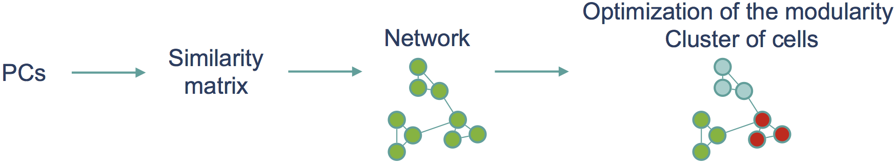

<style>
body{text-align: justify}
pre code, pre, code {
  white-space: pre !important;
  overflow-x: scroll !important;
  word-break: keep-all !important;
  word-wrap: initial !important;
}
</style>


# About the course
__________________

In this course we will discuss of the **`Seurat`** package. **`Seurat`** was originally developed as a clustering tool for scRNA-seq data, however in the last few years the focus of the package has become less specific and at the moment **`Seurat`** is a popular R package that can perform QC, analysis, and exploration of scRNA-seq data. Although the authors provide several tutorials, here we provide an overview by following an example created by the authors of Seurat. We mostly use default values in various function calls, for more details please consult the documentation and the authors. 

This course is directly inspired from http://satijalab.org/seurat/pbmc3k_tutorial.html.  


# Installation / Packages

```{r echo=FALSE, eval=TRUE, message=FALSE, warning=FALSE}
if(!require(Seurat))){
  install.packages('Seurat')
  require(Seurat)
}
if(!require(tidyverse)){
  install.packages('tidyverse')
  require(Seurat)
}
```

```{r echo=TRUE, eval=FALSE, message=FALSE, warning=FALSE}
install.packages('Seurat')
library(Seurat)
install.packages('tidyverse')
library(tidyverse)
```

The `here` package allows us to avoid relative paths and make our analysis code portable. 

```{r echo=TRUE, eval=TRUE, message=FALSE, warning=FALSE}
if(!require(here)){
  install.packages("here")
  library(here)
}
load(here('Jan2018.RData'))
# save.image('Jan2018.RData')
```


# Seurat - Guided Clustering Tutorial
_____________________________________

## Data

For this workshop, we will be analyzing a dataset of Peripheral Blood Mononuclear Cells (PBMC) available from 10x Genomics and downloaded from the Seurat tutorial. There are 2,700 cells that were sequenced on the Illumina NextSeq 500. The raw data can be found here  
&nbsp;&nbsp;&nbsp;&nbsp;&nbsp;&nbsp;&nbsp;&nbsp;&nbsp;&nbsp;&nbsp;&nbsp;https://s3-us-west-2.amazonaws.com/10x.files/samples/cell/pbmc3k/pbmc3k_filtered_gene_bc_matrices.tar.gz  

**`Seurat`** enables easy loading of sparse data matrices provided by 10X Genomics. `Read10X` takes one parameter *data.dir *which is the path to the directory containing the matrix.mtx, genes.tsv and barcodes.tsv files provided by 10X (using CellRanger pipeline). 10x Genomics data can alternatively be opened using the **`cellrangerRkit`** package - not shown here.  

```{r echo=TRUE, eval=FALSE, message=FALSE, warning=FALSE}
##-- Set working directory without absolute paths.
##-- Load the PBMC dataset
pbmc.data <- Read10X(data.dir = here('Data/filtered_gene_bc_matrices/hg19/'))
```


## Setup `seurat` object class

**`Seurat`** introduces its own object class: `seurat`. All calculations in this workshop (dimension reduction, differential expression analysis, etc.) are performed using an object of this class.  

We first initialize the `seurat` object with the raw (non-normalized data). We choose to keep, as proposed in the Seurat tutorial, all genes expressed in >= 3 cells (about 0.1% of the data) and all cells with at least 200 detected genes.  

```{r echo=TRUE, eval=FALSE, message=FALSE, warning=FALSE}
##-- Setup Seurat object class
PBMC <- CreateSeuratObject(raw.data = pbmc.data,
                           min.cells = 3, # Include genes with detected expression in at least this many cells (3 cells)
                           min.genes = 200, # Include cells where at least this many genes are detected (200 genes)
                           project = '10x_PBMC')
```


## Expression Quality Control

The first step in the analysis of a scRNA-seq experiment is quality control (QC).  

**`Seurat`** allows us to easily explore QC metrics and filter cells based on any user-defined criteria. The number of genes and UMIs (nGene and nUMI) are automatically calculated. For non-UMI data, nUMI represents the sum of the non-normalized values within a cell.  

As proposed in the Seurat tutorial, the percentage of mitochondrial genes is calculated and stored in percent.mito using `AddMetaData`. `object@raw.data` is used since this represents non-transformed (normalization and log-transformation) counts. As suggested by Ilicic et al. (2016), high mitochondrial gene expression might be suggestive of low-quality libraries. The percent of UMI mapping to mitochondrial genes is then a common scRNA-seq QC metric.  

```{r echo=TRUE, eval=FALSE, message=FALSE, warning=FALSE}
##-- QC metrics - Percentage of mitochondrial genes
#- percent.mito variable
mito.genes <- grep(pattern = '^MT-', x = rownames(x = PBMC@data), value = TRUE) # 13 mitochondrial genes
percent.mito <- Matrix::colSums(PBMC@raw.data[mito.genes, ]) / Matrix::colSums(PBMC@raw.data) # Matrix package is needed
#- Use of AddMetaData to add column to object@meta.data (great place to store QC metrics)
PBMC <- AddMetaData(object = PBMC, 
                    metadata = percent.mito, 
                    col.name = 'percent.mito')
```

To visualize the QC metrics, there are two functions implemented in **`Seurat`**: `VlnPlot` and `GenePlot`.  

`VlnPlot` draws a violin plot of the QC metrics.  

```{r echo=TRUE, eval=TRUE, message=FALSE, warning=FALSE, fig.width=12, fig.height=6}
##-- QC metrics - VlnPlot()
VlnPlot(object = PBMC, 
        features.plot = c('nGene', 'nUMI', 'percent.mito'), 
        nCol = 3) 
```

`GenePlot` creates a scatter plot of two features. It is usually used to visualize gene-gene relationships, but can be used for anything calculated by the object, *i.e.* columns in `object@meta.data`, PC scores, etc.  

```{r echo=TRUE, eval=TRUE, message=FALSE, warning=FALSE, fig.width=11, fig.height=6}
##-- QC metrics - GenePlot()
par(mfrow = c(1, 2))
GenePlot(object = PBMC, gene1 = 'nUMI', gene2 = 'percent.mito')
GenePlot(object = PBMC, gene1 = 'nUMI', gene2 = 'nGene')
```

In this example, nUMI and nGene are highly correlated (Pearson's correlation - 0.95) - it is not always the case. There is a subset of cells with an outlier level of high-mitochondrial percentage and low UMI content: those cells are filtered out. We also notice that some cells with high UMI/gene content compare to the other cells. Those cells might be doublets; they are discarded.  
`FilterCells` creates a `seurat` object containing only a subset of the cells in the original object. Here, we use the same thresholds as in the Seurat tutorial. Cells that have unique gene counts over 2,500 or less than 200 and more than 5% of mitochondrial genes are filtered out - see below.  

```{r echo=TRUE, eval=FALSE, message=FALSE, warning=FALSE}
##-- Filtering
PBMC_2 <- FilterCells(object = PBMC, 
                      subset.names = c('nGene', 'percent.mito'), 
                      low.thresholds = c(200, -Inf), 
                      high.thresholds = c(2500, 0.05))
# -Inf and Inf should be used if you don't want a lower or upper threshold
```


## Normalization

After removing unwanted cells from the dataset, the next step is to normalize the data. By default, **`Seurat`** employs a global-scaling normalization method *LogNormalize* that normalizes the gene expression measurements for each cell by the total expression, multiplies this by a scale factor (10,000 by default), and log-transforms the result. More methods will be added very shortly.  

```{r echo=TRUE, eval=FALSE, message=FALSE, warning=FALSE}
##-- Normalization
PBMC_2 <- NormalizeData(object = PBMC_2, 
                        normalization.method = 'LogNormalize', 
                        scale.factor = 10000)
```


## Detection of highly variable genes

**`Seurat`** calculates highly variable genes and focuses on these for downstream analysis. `FindVariableGenes` calculates the average expression and dispersion for each gene, places these genes into bins, and then calculates a z-score for dispersion within each bin. This helps control for the relationship between variability and average expression. New methods for variable gene expression identification are coming soon. Seurat developers suggest that users set these parameters to mark visual outliers on the dispersion plot, but the exact parameter settings may vary based on the data type, heterogeneity in the sample, and normalization strategy.  
The parameters here identify about 2,000 variable genes, and represent typical parameter settings for UMI data that is normalized to a total of 10,000 molecules.  

```{r echo=TRUE, eval=TRUE, message=FALSE, warning=FALSE}
##-- Highly variable genes
PBMC_2 <- FindVariableGenes(object = PBMC_2, 
                            mean.function = ExpMean, 
                            dispersion.function = LogVMR,
                            x.low.cutoff = 0.0125, 
                            x.high.cutoff = 3, 
                            y.cutoff = 0.5)
```
```{r echo=TRUE, eval=TRUE, message=FALSE, warning=FALSE}
##-- Highly variable genes
length(PBMC_2@var.genes)
```


## Dealing with confounders  

Single-cell data likely contains unwanted sources of variation. This could include not only technical noise, but batch effects, or even biological sources of variation (cell cycle stage). As proposed by Buettner et al. (2015), regressing uninteresting sources of variation can improve downstream analyses. `ScaleData` constructs linear models to predict gene expression based on user-defined variables, and the resulting residuals are then scaled and centered. The scaled z-scored residuals of these models are stored in `object@scale.data`, and are used for dimensionality reduction and clustering. Cell-cell variation in gene expression driven by batch, cell alignment rate, the number of detected molecules, and mitochondrial gene expression can be regressed out.  
In this example here, we regress on the number of detected molecules per cell (nUMI) as well as the percentage mitochondrial gene content.  

```{r echo=TRUE, eval=FALSE, message=FALSE, warning=FALSE}
##-- Scaling the data and removing unwanted sources of variation - this function takes about 1-2 minutes, might be longer
PBMC_2 <- ScaleData(object = PBMC_2, 
                    model.use = 'linear',
                    vars.to.regress = c('nUMI', 'percent.mito')) # nUMI is used as proxy for Cellular Detection Rate
```


## Perform linear dimensional reduction

Principal component analysis (PCA) is then performed on the scaled-corrected data. By default, the genes in `object@var.genes` are used as input, but can be alternatively defined using pc.genes. Running dimensionality reduction on highly variable genes can improve performance. However, according to Seurat authors, with some types of data (UMI) - especially after removing technical effects, PCA returns similar results when run on much larger subsets of genes, including the whole transcriptome.  

```{r echo=TRUE, eval=FALSE, message=FALSE, warning=FALSE}
##-- PCA
PBMC_2 <- RunPCA(object = PBMC_2, 
                 pc.genes = PBMC_2@var.genes, 
                 pcs.compute = 20,
                 do.print = FALSE)
```

**`Seurat`** provides several useful ways of visualizing both cells and genes that define the PCA, including `PrintPCA`, `VizPCA`,  `PCAPlot`, and `PCHeatmap`.  

`PrintPCA` prints a set of genes that most strongly define a set of principal components.  

```{r echo=TRUE, eval=TRUE, message=FALSE, warning=FALSE}
##-- PCA - PrintPCA
PrintPCA(object = PBMC_2, 
         pcs.print = 1:5,
         genes.print = 5) # genes.print is number of genes to print for each PC
```

`VizPCA` visualizes top genes associated with principal components.  

```{r echo=TRUE, eval=TRUE, message=FALSE, warning=FALSE, fig.width=6}
##-- PCA - VizPCA
VizPCA(object = PBMC_2,
       num.genes = 30,
       pcs.use = 1:2)
```

`PCAPlot` graphs the output of a PCA analysis.  

```{r echo=TRUE, eval=TRUE, message=FALSE, warning=FALSE}
##-- PCA - PCAPlot
PCAPlot(object = PBMC_2, 
        dim.1 = 1, 
        dim.2 = 2)
```


## Selection of PCs for visualization and clustering  

To overcome the extensive technical noise in any single gene for scRNA-seq data, **`Seurat`** uses principal components (PCs) to visualize and cluster cells. Each PC essentially representing a *metagene* that combines information across a correlated gene set. Determining how many PCs to include downstream is therefore a crucial step.  

To determine the number of PCs, there are three main approaches:  

* __jackStraw procedure__: This is a statistical resampling procedure which is used to essentially construct a null distribution for PC scores and will associate each PC with a p-value to enable the assessment of significance in a more formal statistical framework.  

* __Elbow Plot__: Plotting the eigenvalues in decreasing order is a useful visual heuristic - the elbow in the plot tends to reflect a transition from informative PCs to those that explain comparatively little variance. This point generally corresponds well with the significant PCs identified via the jackStraw procedure, but is much faster to obtain.  

* __Supervised Analysis__: Seurat developers suggest that users should explore the PCs chosen for downstream analysis. `PCHeatmap` can display the *extremes* accross both genes and cells, and can be useful to help exclude PCs that may be driven primarily by ribosomal/mitochondrial or cell cycle genes.  

### JackStraw procedure

A resampling test inspired by the jackStraw procedure (Chung and Storey, 2015) is implemented within **`Seurat`**. It randomly permutes a subset of the data (1% by default) and re-runs PCA, constructing a *null distribution* of gene scores, and repeat this procedure (100 by default). It then identifies significant PCs as those who have a string enrichment of low p-value genes.  

This process is time-consuming for large datasets, and may not return a clear PC cutoff. There are more approximate techniques that can be used to reduce computation time. **Please, do not run this procedure**.  

```{r echo=TRUE, eval=FALSE, message=FALSE, warning=FALSE}
##-- JackStraw procedure
PBMC_2 <- JackStraw(object = PBMC_2, 
                    num.pc = 20, 
                    num.replicate = 100, 
                    do.print = FALSE)
```

`JackStrawPlot` provides a visualization tool for comparing the distribution of p-values for each PC with a uniform distribution (dashed line). Significant PCs show a strong enrichment of genes with low p-values (solid curve above the dashed line).  
In this case it appears that PCs 1-11 are significant.

```{r echo=TRUE, eval=TRUE, message=FALSE, warning=FALSE, fig.width=10, fig.height=8}
##-- JackStraw procedure
JackStrawPlot(object = PBMC_2, PCs = 1:12)
```

### Elbow plot

There is a more ad hoc method for determining which PCs to use: look at a plot of the standard deviations of the PCs and draw your cutoff where there is a clear elbow in the graph. This can be done with `PCElbowPlot`. This approach is a heuristic that is commonly used, and can be calculated instantly.  
In this example, it looks like the elbow would fall around PC 9.

```{r echo=TRUE, eval=TRUE, message=FALSE, warning=FALSE, fig.width=4, fig.height=4}
##-- PCElbowPlot
PCElbowPlot(object = PBMC_2,
            num.pc = 20)
```

### Supervised analysis

`PCHeatmap` can also be useful when trying to decide which PCs to include for further downstream analyses. We recommend you to set *cells.use* to a number plots the *extreme* cells on both ends of the spectrum, which dramatically speeds plotting for large datasets. This approach is more supervised, exploring PCs to determine relevant sources of heterogeneity, and could be used in conjunction with GSEA for example. There is no PC driven primarily by ribosomal/mitochondrial or cell cycle genes.  

```{r echo=TRUE, eval=TRUE, message=FALSE, warning=FALSE, fig.width=10, fig.height=14}
##-- PCHeatmap
PCHeatmap(object = PBMC_2, 
          pc.use = 1:12, 
          cells.use = 500, 
          do.balanced = TRUE, 
          label.columns = FALSE, 
          use.full = FALSE)
```

To conclude, PC selection is an important step, but can be challenging. In this example, all three approaches yielded similar results: between 5-10 PCs. As proposed in the Seurat tutorial, we select 10 PCs for downstream analyses (visualization and clustering). We recommend you to always use those three approaches to select your PCs.  


## Perform non-linear dimensional reduction (tSNE visualization)  

To visualize and explore single-cell datasets, **`Seurat`** uses t-Distributed Stochastic Neighbor Embedding (tSNE). This is a technique for dimensionality reduction that is particularly well suited for the visualization of high-dimensional datasets such as scRNA-seq (van der Maaten and Hinton, 2008).  

As input to the tSNE, we suggest using the top 10 PCs (see previous section) (same PCs as input to the clustering analysis), although computing the tSNE based on scaled gene expression is also supported using the *genes.use* argument. Here, Barnes-Hut approximations implementation is used, allowing it to be applied on large real-world datasets.  

```{r echo=TRUE, eval=FALSE, message=FALSE, warning=FALSE}
##-- tSNE
PBMC_2 <- RunTSNE(object = PBMC_2, 
                  dims.use = 1:10, 
                  do.fast = TRUE) # do.fast (if TRUE) uses the Barnes-hut implementation, which runs faster, but is less flexible.
```
```{r echo=TRUE, eval=TRUE, message=FALSE, warning=FALSE}
##-- tSNE
TSNEPlot(object = PBMC_2)
```

## Clustering

The next step is to cluster the cells. Many clustering methods have already been developed (Bacher and Kendziorski, 2016).  
**`Seurat`** implements a graph-based clustering approach. Distances between the cells are calculated based on previously identified PCs (Top 10 here). This approach is heavily inspired by recent manuscripts which applied graph-based clustering approaches to scRNA-seq data: SNN-Cliq (Xu and Su, 2015) and CyTOF data - PhenoGraph (Levine et al., 2015). Briefly, these methods embed cells in a graph structure (*e.g.* K-neareast neighbor (KNN) graph), with edges drawn between cells with similar gene expression patterns, and then attempt to partition this graph into highly interconnected *quasi-cliques* or *communities*.  
**`Seurat`** first constructs a KNN graph based on the euclidean distance in PCA space, and refines the edge weights between any two cells based on the shared overlap in their local neighborhoods (Jaccard distance). To cluster the cells, it applies modularity optimization techniques (Blondel et al., 2008), to iteratively group cells together, with the goal of optimizing the standard modularity function. Modularity is designed to measure how well a network is divided into modules.  

&nbsp;&nbsp;&nbsp;&nbsp;  


&nbsp;&nbsp;&nbsp;&nbsp;  

`FindClusters` implements the procedure, and contains a resolution parameter that sets the granularity of the downstream clustering, with increased values leading to a greater number of clusters. Seurat authors found that setting this parameter between 0.6-1.2 typically returns good results for single cell datasets of around 3,000 cells. Optimal resolution often increases for larger datasets. The clusters are saved in the `object@ident slot`.  

Cells within the graph-based clusters determined above should co-localize on the tSNE plot. This is because the tSNE aims to place cells with similar local neighborhoods in high-dimensional space together in low-dimensional space.  
Here, as proposed in the Seurat tutorial, we set a resolution of 0.6 and a number of neighbors of 30 (by default).  

```{r echo=FALSE, eval=TRUE, message=FALSE, warning=FALSE}
load(here('Jan2018_tmp.RData'))
# save.image('Jan2018_tmp.RData')
```
```{r echo=TRUE, eval=FALSE, message=FALSE, warning=FALSE}
##-- Clustering
PBMC_2 <- FindClusters(object = PBMC_2, 
                       reduction.type = 'pca', 
                       dims.use = 1:10, 
                       resolution = 0.6, 
                       k.param = 30,
                       print.output = 0, 
                       save.SNN = TRUE) # save.SNN = T saves the SNN so that the clustering algorithm can be rerun using the same graph but with a different resolution value (see docs for full details)
```

**`Seurat`** implements a really useful feature that is the ability to recall the parameters that were used in the latest function calls for commonly used functions. For `FindClusters`, they provide `PrintFindClustersParams` to print a nicely formatted summary of the parameters that were chosen.  

```{r echo=TRUE, eval=TRUE, message=FALSE, warning=FALSE}
##-- Clustering
PrintFindClustersParams(object = PBMC_2)
```

There are **eight clusters**.  

```{r echo=TRUE, eval=TRUE, message=FALSE, warning=FALSE}
##-- tSNE - Clustering
TSNEPlot(object = PBMC_2)
```

Given that this clustering step is quite long to run, we recommend you to save the `seurat` object at this point so that it can easily be loaded back in without having to re-run the computationally intensive steps performed above, or easily shared with collaborators.  

```{r echo=TRUE, eval=FALSE, message=FALSE, warning=FALSE}
##-- Save
saveRDS(PBMC_2, file = here('PBMC_tutorial.rds'))
```


## Finding differentially expressed genes and cluster biomarkers  

**`Seurat`** is able to find biomarkers that define clusters via differential expression. By default, `FindMarkers` identifies positive and negative markers of a single cluster (specified in *ident.1*), compared to all other cells. `FindAllMarkers` automates this process for all clusters, but you can also test groups of clusters vs. each other, or against all cells.  

The *min.pct* argument requires a gene to be detected at a minimum percentage in either of the two groups of cells, and the *logfc.threshold* argument requires a gene to be differentially expressed (on average) by some amount between the two groups. You can set both of these to 0, but with a dramatic increase in time - since this will test a large number of genes that are unlikely to be highly discriminatory. As another option to speed up these computations, *max.cells.per.ident* can be set. This will downsample each identity class to have no more cells than whatever this is set to. While there is generally going to be a loss in power, the speed increases can be significiant and the most highly differentially expressed genes will likely still rise to the top.  

**`Seurat`** has nine tests for differential expression which can be set with the *test.use* argument: Wilcoxon test ('wilcox' - by default), Likelihood-ratio test for single cell gene expression ('bimod'), ROC test ('roc'), Student's t-test ('t'), LRT test based on tobit-censoring models ('tobit'), Likelihood ratio test assuming an underlying poisson distribution ('poisson' - use only for UMI-based datasets), Likelihood ratio test assuming an underlying negative binomial distribution ('negbinom' - use only for UMI-based datasets), GLM-framework that treates cellular detection rate (CDR) as a covariate ('MAST') and DE based on a model using the negative binomial distribution ('DESeq2').  
Here, we choose to use **`MAST`** (Finak et al., 2015). MAST proposes a hurdle model tailored to the analysis of scRNA-seq data. A logistic regression model is used to test differential expression rate between groups, while a Gaussian generalized linear model (GLM) describes expression conditionally on non-zero expression estimates. The model also includes the CDR as a covariate to correct for biological and technical nuisance factors that can affect the number of genes detected in a cell (e.g. cell size and amplification bias).  

```{r echo=TRUE, eval=FALSE, message=FALSE, warning=FALSE}
##-- Marker genes
#- Find all markers of cluster 1
cluster1.markers <- FindMarkers(object = PBMC_2, 
                                ident.1 = 1, 
                                min.pct = 0.25,
                                test.use = 'MAST',
                                latent.vars = 'nUMI') # nUMI as proxy for CDR
```
```{r echo=TRUE, eval=TRUE, message=FALSE, warning=FALSE}
##-- Marker genes
#- Find all markers of cluster 1 - Top 5
print(x = head(x = cluster1.markers, n = 5)) 
```
```{r echo=TRUE, eval=FALSE, message=FALSE, warning=FALSE}
##-- Marker genes
#- Find all markers distinguishing cluster 5 from clusters 0 and 3
cluster5.markers <- FindMarkers(object = PBMC_2, 
                                ident.1 = 5, 
                                ident.2 = c(0, 3),
                                min.pct = 0.25,
                                test.use = 'MAST',
                                latent.vars = 'nUMI') # nUMI as proxy for CDR
print(x = head(x = cluster5.markers, n = 5))
```
```{r echo=TRUE, eval=TRUE, message=FALSE, warning=FALSE}
##-- Marker genes
#- Find all markers distinguishing cluster 5 from clusters 0 and 3 - Top 5
print(x = head(x = cluster5.markers, n = 5))
```

*The code below takes some time - about 5 minutes here.*

```{r echo=TRUE, eval=FALSE, message=FALSE, warning=FALSE}
##-- Marker genes
#- Find markers for every cluster compared to all remaining cells, report only the positive ones
pbmc.markers <- FindAllMarkers(object = PBMC_2, 
                               only.pos = TRUE,
                               min.pct = 0.25,
                               logfc.threshold = 0.25, # log-FC
                               return.thresh = 0.01, # Only return markers that have a p-value < 0.01
                               test.use = 'MAST',
                               latent.vars = 'nUMI') # nUMI as proxy for CDR
pbmc.markers %>% 
  group_by(cluster) %>% 
  top_n(2, avg_logFC)
```
```{r echo=TRUE, eval=TRUE, message=FALSE, warning=FALSE}
##-- Marker genes
#- Find markers for every cluster compared to all remaining cells, report only the positive ones - Top 2 for each cluster
pbmc.markers %>% 
  group_by(cluster) %>% 
  top_n(2, avg_logFC)
```

**`Seurat`** implements several tools for visualizing marker expression. `VlnPlot` (shows expression probability distributions across clusters), and `FeaturePlot` (visualizes gene expression on a tSNE or PCA plot) are the most commonly used visualizations.  

```{r echo=TRUE, eval=TRUE, message=FALSE, warning=FALSE, fig.height=3, fig.width=6}
##-- Marker genes - Visualization - VlnPlot
VlnPlot(object = PBMC_2, 
        features.plot = c('PPBP', 'CD79A')) # You can also plot it using UMI with use.raw = TRUE
```
```{r echo=TRUE, eval=TRUE, message=FALSE, warning=FALSE, fig.width=10, fig.height=8}
##-- Marker genes - Visualization - FeaturePlot
FeaturePlot(object = PBMC_2, 
            features.plot = c('MS4A1', 'GNLY', 'CD3E', 'CD14', 'FCER1A', 'FCGR3A', 'LYZ', 'PPBP', 'CD8A'), 
            cols.use = c('grey', 'blue'), 
            reduction.use = 'tsne')
```

`DoHeatmap` generates an expression heatmap for given cells and genes. In this case, we are plotting the top 10 markers for each cluster.

```{r echo=TRUE, eval=TRUE, message=FALSE, warning=FALSE, fig.height=10, fig.width=12}
##-- Marker genes - Visualization - DoHeatmap
top10 <- pbmc.markers %>% 
  group_by(cluster) %>% 
  top_n(10, avg_logFC) 
DoHeatmap(object = PBMC_2, 
          genes.use = top10$gene, 
          slim.col.label = TRUE, 
          remove.key = TRUE)
```


## Assigning cell type identity to clusters

Cluster biomarkers are used to define cell type identity to clusters. In this dataset, we have fortunately access to well-known canonical markers that can be used to easily match the unbiased clustering to known cell types:  

* __IL7R__ - CD4 T cells - Cluster 0;  

* __CD14__, __LYZ__ - CD14+ Monocytes - Cluster 1;  

* __MS4A1__ (CD20) - B cells - Cluster 2;  

* __CD8A__ - CD8 T cells - Cluster 3;  

* __FCGR3A__ (CD16), MS4A7 - CD16+ Monocytes - Cluster 4;  

* __GNLY__, __NKG7__ - NK cells - Cluster 5;  

* __FCER1A__, __CST3__ - Dendritic cells - Cluster 6;  

* __PPBP__ - Megakaryocytes - Cluster 7.  

We can then assign cell type identity to clusters.  

```{r echo=TRUE, eval=TRUE, message=FALSE, warning=FALSE}
##-- Assigning cell type identity to clusters
current.cluster.ids <- c(0, 1, 2, 3, 4, 5, 6, 7)
new.cluster.ids <- c('CD4 T cells', 'CD14+ Monocytes', 'B cells', 'CD8 T cells', 'CD16+ Monocytes', 'NK cells', 'Dendritic cells', 'Megakaryocytes')
PBMC_2@ident <- plyr::mapvalues(x = PBMC_2@ident, 
                                 from = current.cluster.ids, 
                                 to = new.cluster.ids)

```
```{r echo=TRUE, eval=TRUE, message=FALSE, warning=FALSE}
##-- Assigning cell type identity to clusters
TSNEPlot(object = PBMC_2, 
         do.label = TRUE,
         label.size = 4)
```


## Subdivisions within cell types  

As explained in the clustering section (see above), if you perturb some of your parameters (such as resolution or changing the number of PCs), you won't have exactly the same number of clusters.  
For example, in this case, when we set `resolution = 0.8`, we have now **nine clusters**. The CD4 T cells cluster is divided into two sub-clusters. 

```{r echo=FALSE, eval=TRUE, message=FALSE, warning=FALSE}
load(here('Jan2018_tmp_2.RData'))
# save.image('Jan2018_tmp_2.RData')
```
```{r echo=TRUE, eval=FALSE, message=FALSE, warning=FALSE}
##-- Clustering
PBMC_2 <- FindClusters(object = PBMC_2, 
                       reduction.type = 'pca', 
                       dims.use = 1:10, 
                       resolution = 0.8, 
                       k.param = 30,
                       print.output = 0, 
                       save.SNN = TRUE) # save.SNN = T saves the SNN so that the clustering algorithm can be rerun using the same graph but with a different resolution value (see docs for full details)
```
```{r echo=TRUE, eval=TRUE, message=FALSE, warning=FALSE}
##-- tSNE - Clustering
TSNEPlot(object = PBMC_2)
```
```{r echo=TRUE, eval=FALSE, message=FALSE, warning=FALSE}
##-- Marker genes
#- Find markers distinguishing cluster 0 from cluster 1
tcells.markers <- FindMarkers(object = PBMC_2, 
                              ident.1 = 0,
                              ident.2 = 1,
                              min.pct = 0.25,
                              test.use = 'MAST',
                              latent.vars = 'nUMI') # nUMI as proxy for CDR
```
```{r echo=TRUE, eval=TRUE, message=FALSE, warning=FALSE}
##-- Marker genes
#- Find markers distinguishing cluster 0 from cluster 1 - Top 10
print(x = head(x = tcells.markers, n = 10))
```

Many markers tend to be expressed in Cluster 1 (*i.e.* S100A4). However, we do observe that CCR7 is up-regulated in Cluster 0 (CCR7 being a marker of memoy T cells). It strongly indicates that we are able to differentiate memory from naive CD4 cells.  

```{r echo=TRUE, eval=TRUE, message=FALSE, warning=FALSE, fig.width=10, fig.height=4}
##-- Marker genes - Visualization - FeaturePlot
FeaturePlot(object = PBMC_2, 
            features.plot = c('S100A4', 'CCR7'), 
            cols.use = c('grey', 'blue'), 
            reduction.use = 'tsne')
```

The memory/naive split is bit weak, and we would probably benefit from looking at more cells to see if this becomes more convincing. 


# sessionInfo()  

```{r echo=FALSE, eval=TRUE, message=FALSE, warning=FALSE, fig.height=10, fig.width=12}
sessionInfo()
```


# References

Bacher and Kendziorski, **Design and computational analysis of single-cell RNA-sequencing experiments**. *Genome Biol.* 2016; 17:63.  

Blondel et al., **Fast unfolding of communities in large networks**. *Paper available at: arXiv:0803.0476v1* 2008  

Buettner et al., **Computational analysis of cell-to-cell heterogeneity in single-cell RNA-sequencing data reveals hidden subpopulations of cells**. *Nat Biotechnol.* 2015; 33(2):155-60.  

Chung and Storey, **Statistical significance of variables driving systematic variation in high-dimensional data**. *Bioinformatics* 2015; 31(4):545-54.  

Finak et al., **MAST: a flexible statistical framework for assessing transcriptional changes and characterizing heterogeneity in single-cell RNA sequencing data**. *Genome Biol.* 2015; 16:278.  

Ilicic et al., **Classification of low quality cells from single-cell RNA-seq data**. *Genome Biol.* 2016; 17:29.  

Levine et al., **Data-driven phenotypic dissection of AML reveals progenitor-like cells that correlate with prognosis**. *Cell* 2015; 62(1):184-97.  

Satija et al., **Spatial reconstruction of single-cell gene expression data**. *Nat Biotechnol.* 2015; 33(5):495-502.  

van der Maaten and Hinton, **Visualizing high-dimensional data using t-SNE**. *Journal of Machine Learning Research* 2008; 9(Nov):2579-2605.  

Xu and Su, **Identification f cell types from single-cell transcriptomes using a novel clustering method**. *Bioinformatics* 2015; 31:1974-80.  


